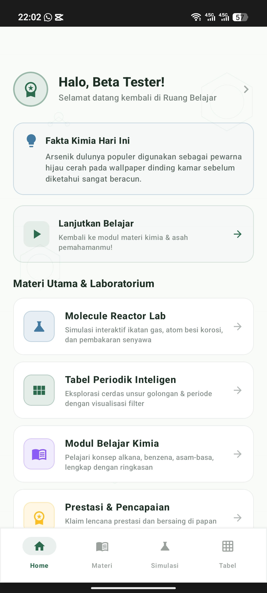
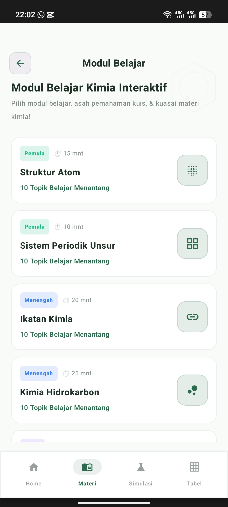
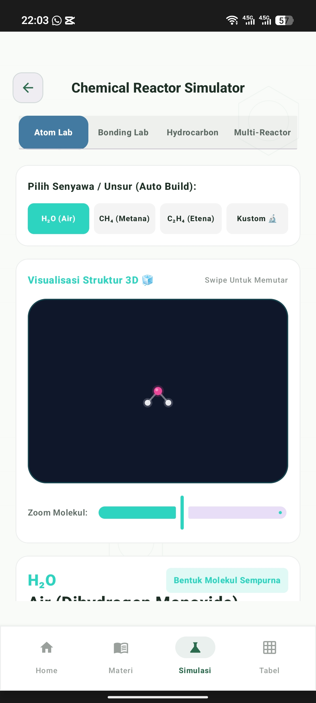
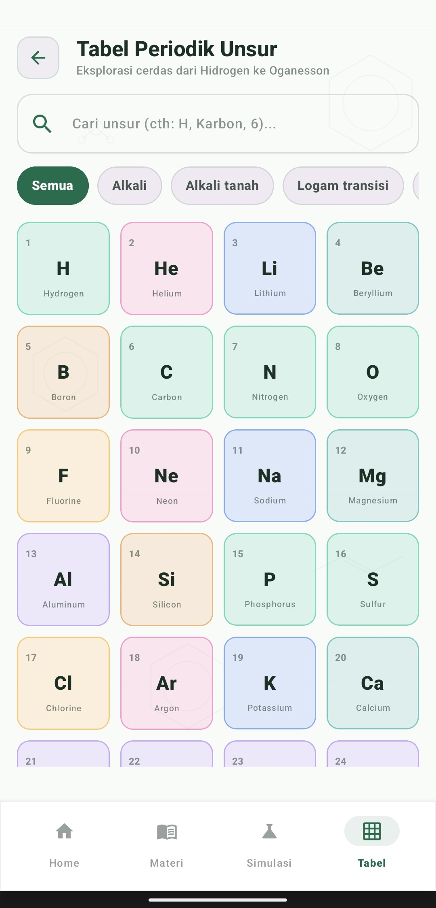

# NeoChem

Interactive chemistry learning application designed to help students understand chemistry concepts through learning modules, flashcards, laboratory simulations, quizzes, and an interactive periodic table.

## Features

- Interactive Learning Modules
- Chemistry Flashcards
- Atom & Bonding Laboratory
- Molecular Visualization
- Interactive Periodic Table
- Achievement & Progress Tracking
- Firebase Cloud Synchronization

## Screenshots

  
  

  
  

## Technology Stack

- Kotlin
- Jetpack Compose
- Room Database
- Firebase Authentication
- Firebase Firestore
- Firebase Storage
- Material Design 3

## Installation

1. Download the latest APK from the Releases page.
2. Enable installation from unknown sources.
3. Install the APK.
4. Launch NeoChem.

## Download

Latest APK:

https://github.com/Veiyl16/NeoChem-Beta/releases/latest

## License

Educational project.
